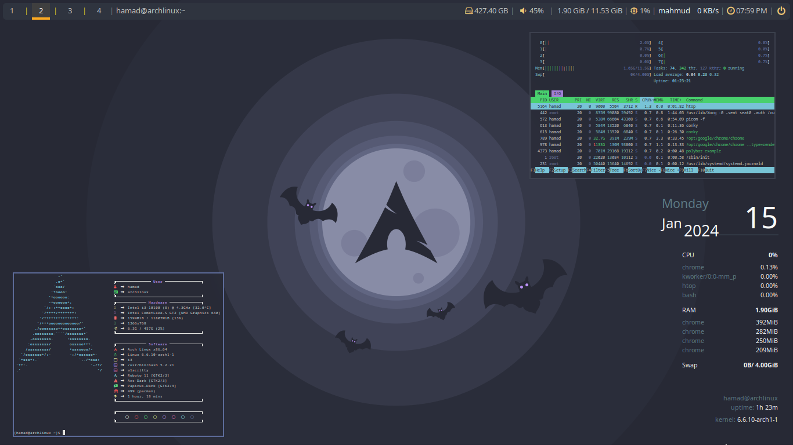
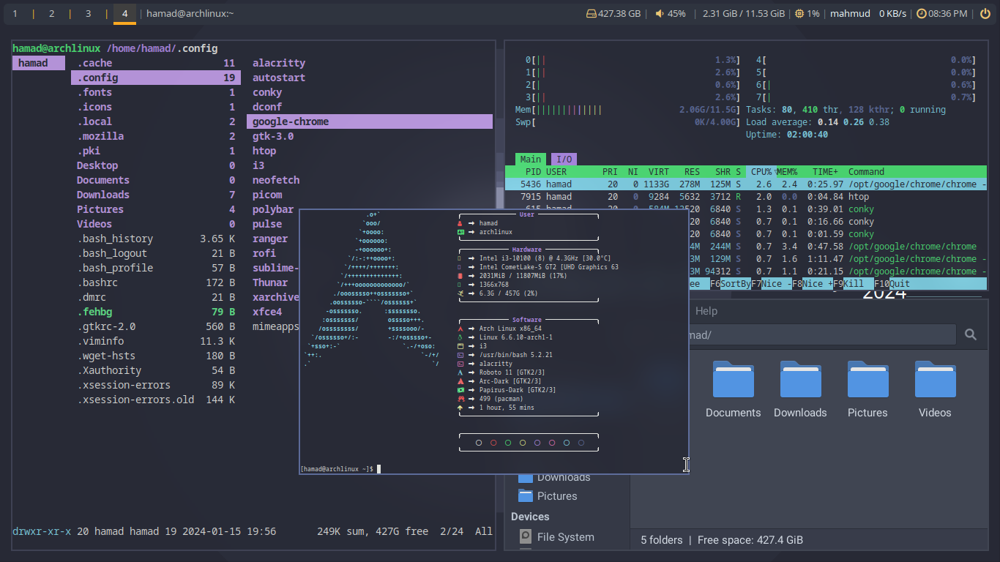

# i3 Tweaks

This repository contains configurations and customizations for the i3 window manager on Linux include required packages.

## Screenshots

### Old Configuration View
<p float="left">
  
  
</p>

### New Configuration View

## Installation

To use these configurations, follow these steps:

1. Clone this repository:
    ```bash
    git clone https://github.com/hamadismail/i3-tweaks.git
    ```

2. Navigate to the repository directory:
    ```bash
    cd i3-tweaks
    ```

3. Copy the configuration files to your i3 config directory:
    ```bash
    cp -r .config/i3 ~/.config/
    ```

4. Restart i3 to apply the new configurations.

## Configuration

### Flatpak

To configure flatpak, follow these steps:

1. Get access the filesystem:\
    System mode 
    ```bash
    sudo flatpak override --filesystem=$HOME
    ```
    User mode
    ```bash
    flatpak --user override --filesystem=$HOME
    ```

2. Get access the themes and icons:\
    For color theme
    ```bash
    flatpak --user override --env=GTK_THEME=Theme-name
    ```
    For icon theme
    ```bash
    flatpak --user override --env=ICON_THEME=Icon-name
    ```
    
4. Open link in browser tab:\
   Manually try to open a URL from the flatpak sandbox
   ```bash
   flatpak run --command=xdg-open com.spotify.Client https://www.google.com
   ```
   That is supposed to request a new browser tab or window, requested from within the sandbox
   
   Check if xdg-desktop-portal is installed:
   ```bash
   sudo pacman -S xdg-desktop-portal xdg-desktop-portal-gtk
   ```
   Restart the portal services:
   ```bash
   systemctl --user restart xdg-desktop-portal
   systemctl --user restart xdg-desktop-portal-gtk
   ```
   Fixing postman crashing issue:\
   Go to the location
   ```bash
   ~/.var/app/com.getpostman.Postman/config/Postman/proxy
   ```
   And use this command
   ```bash
   openssl req -subj '/C=US/CN=Postman Proxy' -new -newkey rsa:2048 -sha256 -days 365 -nodes -x509 -keyout postman-proxy-ca.key -out postman-proxy-ca.crt
   ```

### Disk Encryption and Decryption Using LUKS
🔐 Create Disk Encryption:\
1. Add Disk Encryption
```
sudo cryptsetup -y luksFormat /dev/sdX
```
replace X with your disk

2. Open Encrypted Disk
```
sudo cryptsetup -v luksOpen /dev/sdX <name-encrypted-disk>
```

3. Format the Encrypted Disk
```
sudo mkfs.exfat /dev/mapper/<name-encrypted-disk>
```

4. Mount the Encrypted Disk
```
sudo mount /dev/mapper/<name-encrypted-disk> /mnt/<directory-name>
```

5. Unmount the Encrypted Disk
```
sudo umount /mnt/<directory-name>
```

6. Close the Encrypted Disk
```
sudo cryptsetup -v luksClose <name-encrypted-disk>
```

---

❌ Remove Disk Encryption:\
1. (Erase Disk)
```
sudo cryptsetup erase /dev/sdX
```

2. Format the Disk for Normal Use
```
sudo mkfs.exfat /dev/sdX
```


## Usage

After installation, you can use the following keybindings (or whatever custom bindings you have set up):

- `Mod + Enter`: Open terminal
- `Mod + d`: Open dmenu
- `Mod + q`: Close window
- `Mod + h/j/k/l`: Navigate windows

For more details, refer to the configuration files.

## Contributing

If you have suggestions for improvements or new features, feel free to open an issue or submit a pull request.

<!----
## License

This repository is licensed under the MIT License. See the [LICENSE](LICENSE) file for more details.


-->
